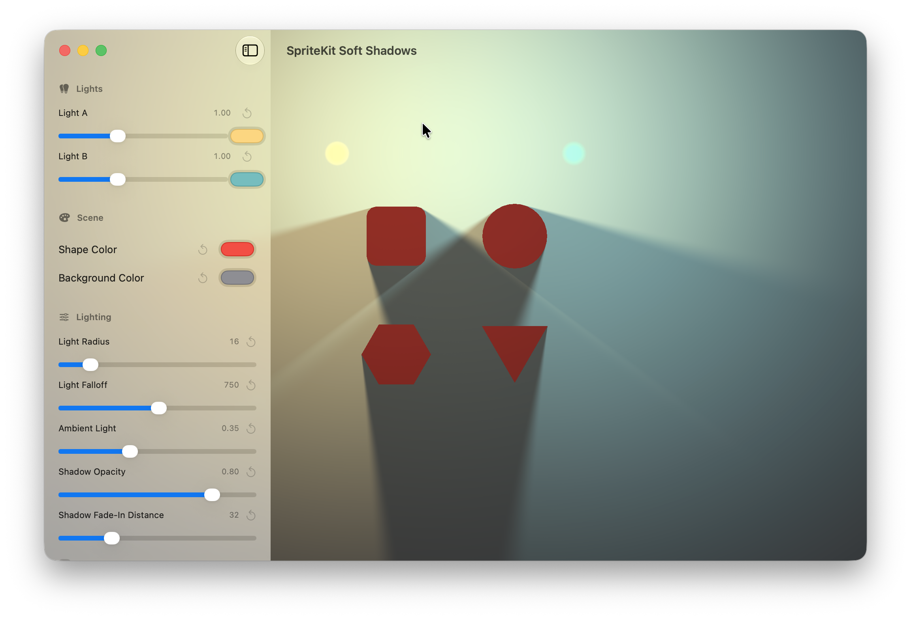
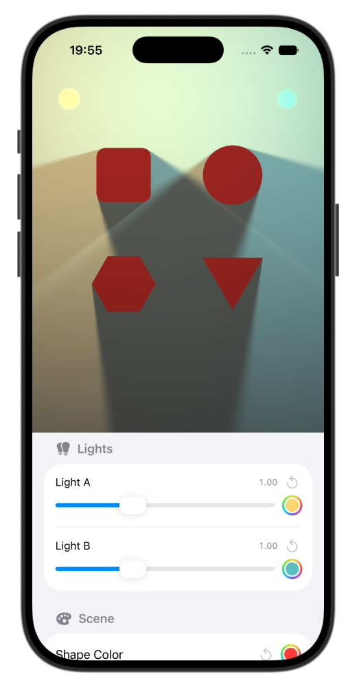

# SpriteKit Soft Shadows

This is a demo implementation of area lighting with soft shadows using Apple SpriteKit and Metal.

## How It Works

The demo uses an `MTKView` to drive the rendering loop at the desired frame rate. Each frame:

- SpriteKit renders the scene into a Metal texture using `SKRenderer`.
- The CPU sends each light's properties and the relevant shape edges to a Metal vertex shader.
- The vertex shader projects shadow geometry from each edge.
- A fragment shader calculates the shadow opacity at each pixel, producing a soft shadow mask for each light.
- A final fragment shader combines the SpriteKit texture, lights, and shadow masks to produce the displayed image.

The SwiftUI controls update variables inside the SpriteKit scene through `@Observable`.  The rendering loop consumes the new values on its next cycle.

## Getting Started

The project comes with a demo app that runs on macOS and iOS. To launch the app:

- Download an open the project in Xcode
- Update the project's signing
- Select a target device or simulator
- Run

## Findings

- When Metal API Validation is enabled in Product > Scheme > Edit Scheme > Diagnostics, `SKRenderer` requires setting an explicit stencil texture attachment.
- When a project targets Mac Catalyst, the UI can be changed to look like iOS or macOS in Project Settings > Target > General > Deployement Info > Mac Catalyst Interface
- Sprite nodes can render Display P3 colors. However, shape nodes seem to only support sRGB. Colors outside the sRGB range may wrap, producing entirely different colors.

## Links

- Scott Lembcke, [2D Lighting with Soft Shadows](https://www.slembcke.net/blog/SuperFastSoftShadows/), 2021.
- Apple, [Metal Best Practices Guide, Triple Buffering](https://developer.apple.com/library/archive/documentation/3DDrawing/Conceptual/MTLBestPracticesGuide/TripleBuffering.html).
- A thread mentioning [SKRenderer color space](https://developer.apple.com/forums/thread/817914?answerId=885088022) on Apple Developer Forums. May be relevant to shape nodes color space issues.

